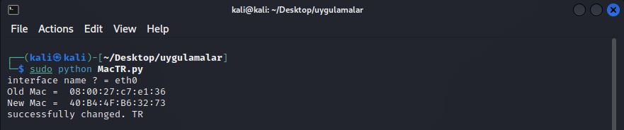

# Anonymous - Mac Changer TR 
cyber security anonymity mac changer

# How to download
Enter the code into the terminal
```
sudo git clone https://github.com/Anonim-ghost/macTR.git
```
# How to use
Run the code in the directory where it is located
```
sudo python3 MacTr.py
```
After running the code, enter the interface name

![Photo by Roman Synkevych on Unsplash][resim]

[resim]: mactr1.jpg 

When the Mac address changes, you will get the result as shown in the picture


 

